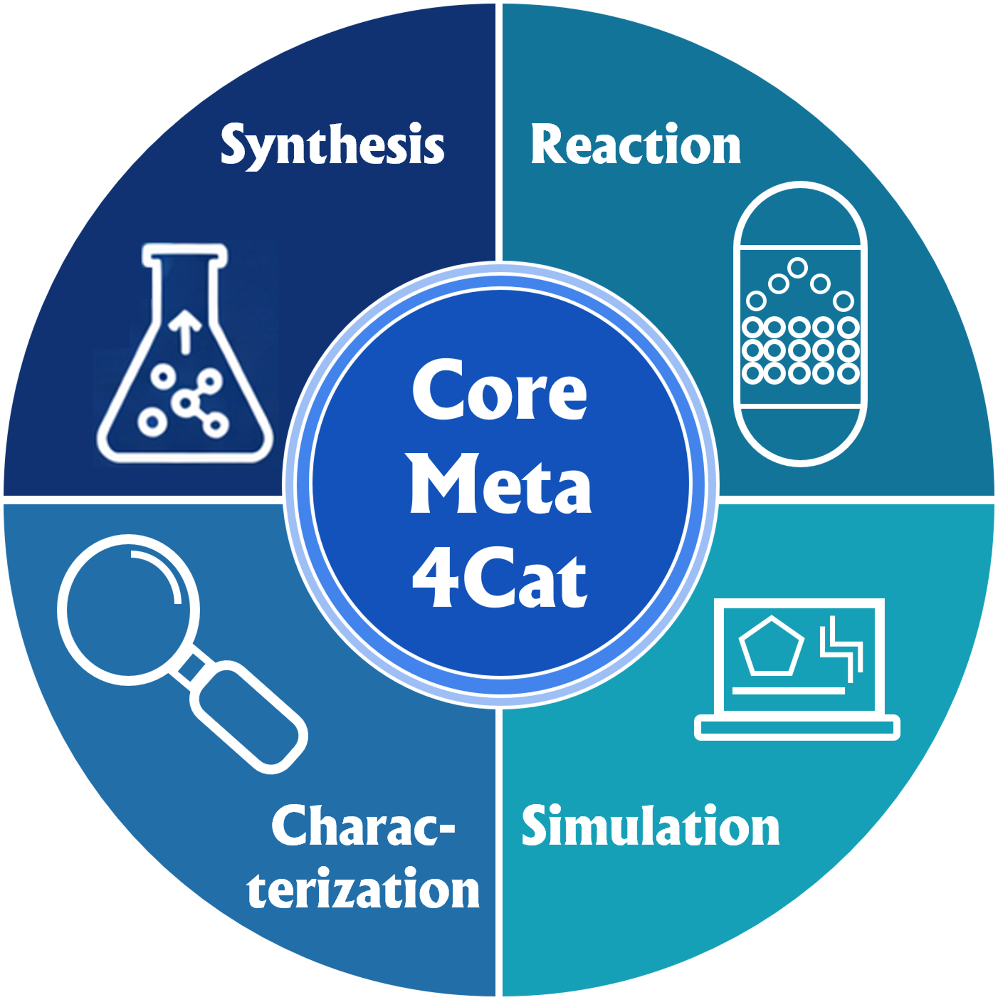

# Intended Users

CoreMeta4Cat is designed for anyone who produces, manages, or builds tools around catalysis research data. This page describes who the standard is for, how different groups use it, and which projects and repositories have adopted it.

---

## Who is CoreMeta4Cat for?

### Experimental researchers

If you run catalytic experiments — synthesis, characterisation, reaction testing — CoreMeta4Cat tells you exactly what metadata to record alongside your data so that it can be understood and reused by others, including your future self. You do not need to know anything about schemas, ontologies, or FAIR principles to use it. Start with the [vocabulary reference workbook](https://nfdi4cat.github.io/CoreMeta4Cat/latest/assets/coremeta4cat_vocabulary.xlsx) and the [Getting Started](https://nfdi4cat.github.io/CoreMeta4Cat/latest/getting-started/) guide.

**CoreMeta4Cat helps you:**
- Know which metadata fields are mandatory, recommended, or optional for your specific experiment type
- Use consistent field names and units that other researchers — and data repositories — will recognise
- Prepare your dataset for publication, repository deposit, or FAIR compliance without extra rework

### Computational researchers

If you run DFT calculations, molecular dynamics simulations, or microkinetic models, CoreMeta4Cat defines the minimum metadata for your computational outputs — software, method, settings, and calculated properties. The same vocabulary links your simulation data to experimental datasets, enabling direct comparison and validation.

### Data stewards and repository managers

If you manage a research data repository or institutional data infrastructure, CoreMeta4Cat provides a validated, community-agreed schema for catalysis data intake. The LinkML source generates SHACL shapes, JSON Schema, and Python/Pydantic classes automatically, making integration into existing repository workflows straightforward.

**CoreMeta4Cat gives you:**
- A structured, versioned metadata schema with clear obligation levels (Mandatory / Recommended / Optional)
- Automatic generation of validation artefacts (SHACL, JSON Schema) from a single source
- A direct connection to the Voc4Cat controlled vocabulary and DCAT-AP-PLUS provenance layer

### Tool and ELN developers

If you develop electronic lab notebooks, data management platforms, or analysis tools used in catalysis labs, CoreMeta4Cat provides a community-agreed data model to map your internal schema against. Aligning your tool's output to CoreMeta4Cat makes your users' data immediately compatible with repositories and other tools in the NFDI4Cat ecosystem.

### PhD students and early-career researchers

If you are new to research data management, CoreMeta4Cat is a practical starting point. Rather than confronting abstract FAIR principles, it gives you a concrete, catalysis-specific list of what to document for your experiment type. The [Getting Started](https://nfdi4cat.github.io/CoreMeta4Cat/latest/getting-started/) page is written for exactly this audience — no prior knowledge of metadata standards required.

---

## How different groups use CoreMeta4Cat

| User type | Primary use | Entry point |
|---|---|---|
| Experimental researcher | Record and annotate dataset metadata | [Vocabulary workbook](https://nfdi4cat.github.io/CoreMeta4Cat/latest/assets/coremeta4cat_vocabulary.xlsx) · [Getting Started](https://nfdi4cat.github.io/CoreMeta4Cat/latest/getting-started/) |
| Computational researcher | Document simulation inputs, settings, and outputs | [Simulation data class](https://nfdi4cat.github.io/CoreMeta4Cat/latest/simulation/) |
| Data steward / repository | Implement as metadata intake schema | [Schema Reference](https://nfdi4cat.github.io/CoreMeta4Cat/latest/elements/overview/) · [Design Patterns](https://nfdi4cat.github.io/CoreMeta4Cat/latest/design-patterns/) |
| Tool / ELN developer | Map internal schema to CoreMeta4Cat | [How to Extend](https://nfdi4cat.github.io/CoreMeta4Cat/latest/how-to-extend/) · [GitHub](https://github.com/nfdi4cat/CoreMeta4Cat) |
| PhD student | Learn what metadata to document | [Getting Started — Level 1 and 2](https://nfdi4cat.github.io/CoreMeta4Cat/latest/getting-started/) |

---

## Projects and repositories using CoreMeta4Cat

CoreMeta4Cat is developed within the [NFDI4Cat](https://nfdi4cat.org) initiative — the National Research Data Infrastructure consortium for catalysis sciences in Germany. NFDI4Cat brings together universities, research institutions, and industrial partners to build shared data infrastructure for the catalysis community.

!!! info "Is your project listed here?"
    If your project, repository, or tool uses CoreMeta4Cat, please open an issue or pull request on the [CoreMeta4Cat GitHub repository](https://github.com/nfdi4cat/CoreMeta4Cat) with the following information:

    | Field | What to provide |
    |---|---|
    | **Project name** | The name of the project, repository, or tool |
    | **Organisation** | The institution or consortium responsible |
    | **Description** | One or two sentences on how CoreMeta4Cat is used |
    | **Link** | A URL to the project, dataset collection, or publication |
    | **Contact** | An optional name or email for follow-up |

---

## Scope of adoption

CoreMeta4Cat can be adopted at different levels depending on your use case — from simply using the vocabulary reference as a documentation guide, all the way to full semantic integration.

**Metadata collection and submission**
Research groups can use CoreMeta4Cat to structure the metadata they report alongside published datasets, whether in institutional repositories, domain repositories, or supplementary materials of publications.

**Repository integration**
Data repository operators can implement CoreMeta4Cat as their metadata intake schema, enabling structured, validated metadata submission from depositing researchers. The LinkML source generates SHACL shapes, JSON Schema, and Python/Pydantic classes out of the box, making integration straightforward.

**Workflow tools and ELNs**
Electronic lab notebooks (ELNs) and data management tools used in catalysis labs can map their internal data models to CoreMeta4Cat, enabling automatic metadata export in a standardised format.

**Knowledge graph and semantic web applications**
Because CoreMeta4Cat maps every class and slot to established ontology terms (Voc4Cat, CHMO, OBI, NCIT, …), instance data can be exported as RDF and loaded into a triple store or knowledge graph for semantic querying across datasets.

---

## Related resources

| Resource | Description |
|---|---|
| [Voc4Cat](https://nfdi4cat.github.io/voc4cat/) | The NFDI4Cat controlled vocabulary, used for `rdf_type` classification terms throughout CoreMeta4Cat |
| [DCAT-AP-PLUS](https://nfdi-de.github.io/dcat-ap-plus/dev/) | The base provenance layer that CoreMeta4Cat extends |
| [LinkML](https://linkml.io/) | The schema language and tooling used to define and validate CoreMeta4Cat |
| [CoreMeta4Cat on GitHub](https://github.com/nfdi4cat/CoreMeta4Cat) | Schema source files, issue tracker, and contribution guide |
